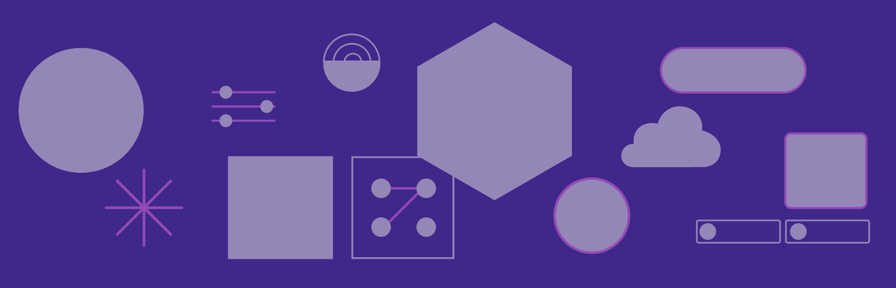

<Hero slots="image, heading, text" background="rgb(64, 34, 138)"/>

# CC Libraries API

CC Libraries are accessible across all of Adobe's tools and offer a powerful way to organize logos, colors, and other assets so they can be easily accessed and re-used. The CC Libraries API lets you bring Libraries to your products and services.

<Resources slots="heading, links"/>

#### Resources

- [Code samples repo](https://github.com/cc-libraries-api/code-samples)
- [Postman collection](https://github.com/cc-libraries-api/api-docs/blob/master/adobe_cc_libraries_apis.postman_collection.json)
- [CC Libraries GitHub org](https://github.com/cc-libraries-api)
- [CC Libraries Documentation repo](https://github.com/AdobeDocs/cc-libraries-api)

## Welcome

Welcome to the CC Libraries API documentation! Here you can learn all about CC Libraries, read development guides, explore endpont references, and find tools and sample code.

<DiscoverBlock slots="heading, link, text"/>

### Orientation to CC Libraries

[What are CC Libraries?]()

If you're new to CC Libraries, get started by having a look at this service from the user perspective.

<DiscoverBlock slots="link, text"/>

[What can I do with this API?]()

A high-level introduction to key features this API supports.

## Integrate

<DiscoverBlock slots="heading, link, text"/>

### Setup

[How to get your developer credentials]()

Before you get started, you'll need a Client ID and Secret. We'll show you how to get them on the Adobe Developer Console.

<DiscoverBlock slots="link, text"/>

[How to get access tokens with OAuth]()

See where to learn more about Adobe OAuth 2.0 and try our OAuth 2.0 Playground for a quicker start.

<DiscoverBlock slots="heading, link, text"/>

### Tutorials

[Quick Start with cURL]()

Make your first API call via the cURL command-line tool.

<DiscoverBlock slots="link, text"/>

[Quick Start with Node.js]()

Make your first API call from a Node.js script.

<DiscoverBlock slots="heading, link, text"/>

### Guides

[Working with CC Library elements]()

lorem

<DiscoverBlock slots="link, text"/>

[Using hypermedia links]()

lorem

<DiscoverBlock slots="link, text"/>

[Configuring webhooks for CC Libraries Events]()

lorem

<DiscoverBlock slots="heading, link, text"/>

### API References

[Try the API](api/)

Try the Analytics API with Swagger UI. Explore, make calls, with full endpoint descriptions.

## Design

_design resources here_

## Go live

_submission and review resources here_

## Join the community

We'd love for you to get involved in the way that's best for you. You can:

- Join our developer forums to meet other developers, ask questions, and offer help
- Contribute issues and pull requests to our open source repos, including:
  - [CC Libraries org on GitHub](https://github.com/cc-libraries-api)
  - [CC Libraries Documentation repo on GitHub](https://github.com/AdobeDocs/cc-libraries-api)
